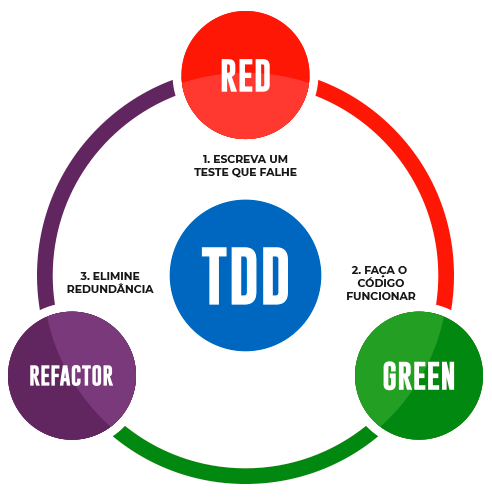

# Introdução ao TDD (Test-Driven Development)

Este repositório tem o intuito de trazer alguns práticas e exemplos de códigos para introdução do desenvolvimento orientado a teste (TDD).

## Introdução

Test-Driven Development ou Desenvolvimento Orientado a Testes é uma técnica de desenvolvimento de software que guia o desenvolvedor a escrever os testes antes do código-fonte.

Quais as vantagens do TDD:

- Todo código escrito tem um teste associado.
- Foca na funcionalidade.
- Melhora o design de classes.
- Aumenta a cobertura de testes.
- Segue um ciclo de três etapas.

### Ciclo do Test-Driven Development

1. Escolha uma funcionalidade
2. Escreva um teste
3. Execute o teste e veja falhar (RED)
4. Desenvolva a funcionalidade de forma simples
5. Execute o teste e veja passar (GREEN)
6. Refatore (REFACTOR)
7. Volte para o passo de escrever um teste

Imagem adaptada de [treinaweb.com.br/blog/afinal-o-que-e-tdd](https://www.treinaweb.com.br/blog/afinal-o-que-e-tdd)

Regras para o TDD:
- Não escreva código antes de escrever uma especificação de teste que falhe.
- Não escreva mais do que um teste para falhar (um de cada vez).
- Escreva somente código suficiente para que o teste passe (o mais simples possível).

## Práticas

Prática Básica de TDD: [Número Romano](docs/NUMEROROMANO.md)

## Bibliografia

- Test-Driven Development: Teste e Design no Mundo Real. ANICHE, Mauricio. 